---

## 🛠️ Tech Stack

---

## 🎮 Studio

**Strayline Games Studio** · *Co-Founder* · *August 2026 – Present*

Indie studio of 3 devs building **CRIMSONCARVE**, a rogue-like. I engineer core mechanics and event graphs using Unreal Engine Blueprints and node-based visual scripting, and manage binary asset streams and version control with Perforce (P4).

---

## 💼 Experience

**Digital Gaming Intern** · *London Borough of Hillingdon Council* · *Summer 2026*  
Designed and developed an interactive educational game putting Year 6 pupils inside the Dowding System during the Battle of Britain. Built with JavaScript and Phaser 3 as a PWA, optimised for tablet-first classroom use.  
→ [Eyes On The Sky](https://github.com/Slayniaccc/EyesOnTheSky) · [play it](https://slayniaccc.github.io/EyesOnTheSky/)

---

## 🏗️ Current Project

### [Sports Conflict Tracker](https://github.com/Slayniaccc/sports-conflict-tracker)
*Java 21 · Spring Boot 3.3 · Postgres 16 · Flyway · TypeScript · Tailwind · Docker · GitHub Actions*

Detects fixture clashes across your followed sports teams and scores which one to watch, with reasoning. NBA, NFL, MLB and EPL data from BALLDONTLIE and Football-Data.org.

- **Core**: A pure-Java rule engine scores conflicts on rivalry, playoff implications, form and home/away — layered with Spring, not through it
- **Backend**: JWT auth, Flyway migrations (V1–V5), composite `(league, external_id)` constraints, paginated provider syncs
- **Frontend**: TypeScript + Tailwind (in progress)
- **Infra**: Docker, GitHub Actions, deploying to Railway/Fly.io

---

## 👥 Leadership

**Secretary @ Brunel Cyber Security Society** · *2026–27*  
Run a student-led community focused on security workshops and CTFs. Manage comms, event planning, and digital presence.  
[Website](https://brunelcybersec.github.io/brunel-cyber-society/) · [GitHub](https://github.com/brunelcybersec)

**PAL Leader @ Brunel University London** · *2026–27*  
Support first-years through peer-assisted learning, study skills, and weekly mentoring.

---

## 📁 Projects

| Project | What it does | Built with |
|---|---|---|
| **[Eyes On The Sky](https://github.com/Slayniaccc/EyesOnTheSky)** | Digital gaming internship — tablet-first educational game putting Year 6 pupils inside the Dowding System | JS · Phaser 3 · PWA · [play](https://slayniaccc.github.io/EyesOnTheSky/) |
| **[Mastermind](https://github.com/Slayniaccc/mastermind)** | Colour-guessing game with feedback, hints, scoring and file logging | Java · Raspberry Pi |
| **[Simon Swift](https://github.com/Slayniaccc/simonswift)** | Memory game on Raspberry Pi driving LEDs, buttons and motion sensors | Java · Raspberry Pi |
| **[Repo Card Generator](https://github.com/Slayniaccc/github-repo-card-generator)** | Customisable GitHub repo cards on the GitHub API | JS · HTML · CSS |

---

## 🏆 Sports

Fan of the **Dodgers**, **Ravens**, **Man City** and **Sixers**.

---

